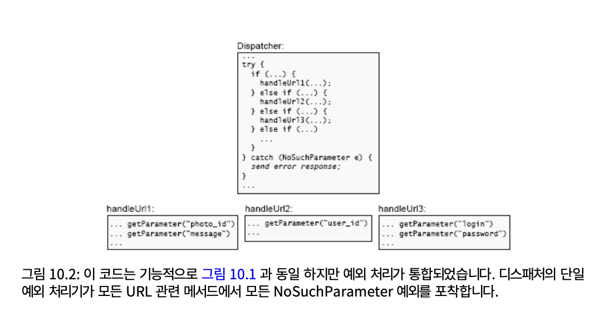

# 10. 존재하지 않는 오류

예외 처리는 소프트웨어 시스템을 복잡하게 만드는 최악의 원인 중 하나다.

## 10.1 예외가 복잡성을 더하는 이유

메소드가 정상적인 동작을 완료하지 않았음을 나타내는 특수 값을 반환하는 경우와 같이 공식적인 예외 보고 메커니즘을 사용하지 않고도 예외가 발생할 수 있다. 이러한 모든 형태의 예외는 복잡성을 가중시킨다.

특정 코드 부분에서 예외가 발생하는 케이스

- 호출자가 잘못된 인수나 구성 정보를 제공
- 호출된 메서드가 요청된 작업을 완료하지 못할 때
- 코드 버그
- 분산 시스템에서 네트워크 패킷이 손실되거나 지연될 때

예외 처리 코드는 본질적으로 일반적인 경우의 코드보다 작성하기가 더 어렵다.

예외가 발생하면 프로그래머는 두 가지 방법으로 처리할 수 있다.

1. 예외에도 불구하고 진행 중인 작업을 계속 진행하고 완료하기
2. 진행중인 작업을 중단하고 예외를 위쪽으로 보고

예외 처리 코드는  더 많은 예외에 대한 기회를 만든다. 끝없는 예외 발생을 방지하려면 개발자는 결국 더 많은 예외를 발생시키지 않고 예외를 처리할 수 있는 방법을 찾아야 한다.

예외에 대한 언어 지원은 장황하고 투박한 경향이 있어 예외 처리 코드를 읽기 어렵게 만든다.

실제로 예외를 처리하는 코드는 고려하지 않고 기본적인 `try-catch`만 사용하면 일반적인 경우의 작업 코드보다 더 많은 줄을 차지한다.

## 10.2 예외가 너무 많다

프로그래머는 불필요한 예외를 정의하여 예외 처리와 관련된 문제를 악화시키기도 한다. 대부분의 프로그래머는 오류를 감지하고 보고하는 것이 중요하다고 배운다. 이는 조금이라도 의심스러워 보이는 것은 무엇이든 예외를 두어 과잉 방어 스타일로 이어지고 결과적으로 시스템의 복잡성을 증가시키는 불필요한 예외가 급증하게 된다.

## 10.3 오류 제거

예외 처리 복잡성을 제거하는 가장 좋은 방법은 처리할 예외가 없도록 API를 정의하는 것이다.

<aside>
💡

존재하지 않는 오류를 정의한다??

</aside>

## 10.4 예: Windows에서 파일 삭제

## 10.5 예: Java 하위 문자열 방법

전반적으로 버그를 줄이는 가장 좋은 방법은 소프트웨어를 . 더단순하게 만드는 것이다.

## 10.6 마스크 예외

예외를 처리해야 하는 위치 수를 줄이는 두 번째 기술은 예외 마스킹이다. 이 접근 방식을 사용하면 예외적인 조건이 시스템의 낮은 수준에서 감지되고 처리되므로 더 높은 수준의 소프트웨어가 해당 조건을 인식할 필요가 없다.

예외 마스킹은 모든 상황에서 작동하지는 않지만 작동하는 상황에서는 강력한 도구이다. 클래스의 인터페이스를 줄이고 예외를 마스크  하는 코드 형태로 기능을 추가하므로 클래스가 더 깊어진다.

## 10.7 예외 집계

예외 집계의 기본 아이디어는 단일 코드로 많은 예외를 처리하는 것이다. 많은 개별 예외에 대해 별도의 처리기를 작성하는 대신 단일 처리기를 사용하여 한곳에서 모두 처리한다.

  

## 10.8 그냥 충돌이 발생하나요?

예외 처리와 관련된 복잡성을 줄이는 네 번째 기술은 애플리케이션을 충돌시키는 것이다.

가장 단단한 대응 방법은 진단 정보를 인쇄한 다음에 애플리케이션을 중단하는 것이다.

## 10.9 존재하지 않은 특별한 경우를 디자인한다

추가 코드 없이 특수 사례를 자동으로 처리하는 방식으로 일반 사례를 설계하는 것이다.

## 10.10 너무 지나치다

예외를 정의하거나 모듈 내부에서 마스킹하는 것은 예외 정보가 모듈 외부에서 필요하지 않은 경우에만 의미가 있다.

예외를 제외하고 소프트웨어 설계의 다른 많은 영역과 마찬가지로 무엇이 중요한지, 무엇이 중요하지 않는지를 결정해야 한다. 중요하지 않은 일은 숨겨야 하고, 많을수록 좋다. 하지만 중요한 것이 있으면 공개해야 한다.

## 10.11 결론

모든 형태의 특수한 경우는 코드를 이해하기 어렵게 만들고 버그 가능성을 높인다.
