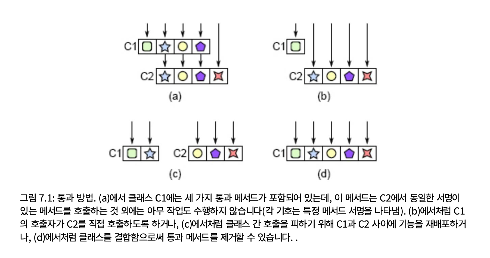
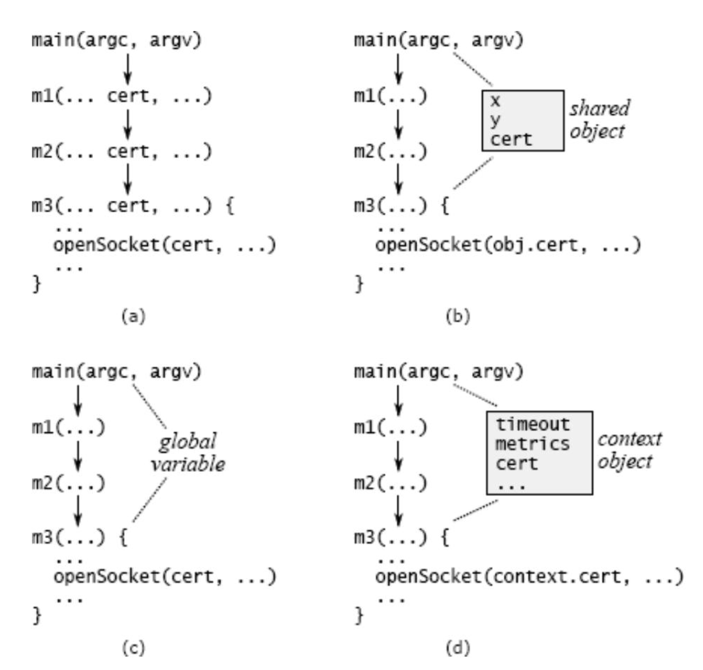

# 7. 다양한 레이어, 다양한 추상화

소프트웨어 시스템은 계층으로 구성되며 상위 계층은 하위 계층이 제공하는 기능을 사용한다.

잘 설계된 시스템에서 각 계층은 위 및 아래 계층과 다른 추상화를 제공한다.

시스템에 유사한 추상화를 가진 인접한 레이어가 포함되어 있는 경우 이는 클래스 분해에 문제가 있음을 나타내는 위험 신호다.

## 7.1 통과 방법

통과 메서드는 호출 메서드의 서명과 유사하거나 동일한 다른 메서드를 호출하는 것 외에는 거의 수행하지 않는 메서드다.

<aside>
💡

위험 신호: 통과 방법
통과 메서드는 일반적으로 통과 메서드와 동일한 API를 사용하여 인수를 다른 메서드에 전달하는 것 외에는 아무 작업도 수행하지 않는 메서드다. 이는 일반적으로 클래스 간에 책임이 명확하게 구분되지 않았음을 나타낸다.

</aside>

통과 방법은 클래스를 더 얕게 만든다.

통과 방법은 클래스 간의 책임 분배에 혼란이 있음을 나타낸다.

해결책은 각 클래스가 고유하고 일관된 책임 집합을 갖도록 클래스를 리팩터링하는 것이다.

  

## 7.2 인터페이스 복제는 언제 괜찮나요?

통과 방법은 새로운 기능을 제공하지 않기 때문에 좋지 않다.

## 7.3 데코레이터

테코레이터 디자인 패턴은 레이어 간 API 복제를 장려하는 패턴이다.

데코레이터 개체는 기존 개체를 가져와 해당 기능을 확장한다.

데코레이터의 동기는 클래스의 특수 목적 확장을 보다 일반적인 코어에서 분리하는 것이다.

데코레이터 패턴을 남용하면 모든 작은 새 기능에 대해 새 클래스를 생성하기 쉽다.

### 데코레이터 클래스를 만들기 전에 아래 대안을 고려하자

1. 기본 클래스에 직접 새 기능을 추가할 수 있는가?
2. 새로운 기능이 특정 사용 사례에 특화된 경우 별도의 클래스를 만드는 대신 해당 기능을 사용 사례와 병합하는 것이 합리적일까?
3. 새 데코레이터를 만드는 대신 새 기능을 기존 데코레이터와 병합할 수 있나?
4. 새로운 기능이 실제로 기존 기능을 래핑해야하는가?

## 7.4 인터페이스 대 구현

다른 계층, 다른 추상화 규칙의 또 다른 적용은 클래스의 인터페이스가 일반적으로 구현과 달라야 한다는 것이다. 즉 내부적으로 사용되는 표현이 달라야 한다.

## 7.5 통과 변수

계층 간 API 복제의 또 다른 형태는 통과 변수다. 이는 긴 메소드 체인을 통해 전달되는 변수다.

  

통과 변수는 메소드가 변수를 사용하지 않더라도 모든 중간 메소드가 자신의 존재를 인식하도록 하기 때문에 복잡성을 추가한다.

<aside>
💡

통과 변수를 읽다 보니 프론트의 Props drilling이 생각났습니다.
국문: <https://codingpracticenote.tistory.com/56>
영어: <https://medium.com/@omkarbhavare2406/prop-drilling-in-react-8819c609c376>

  

</aside>

저자가 자주 사용하는 해결책은 컨텍스트 개체를 도입하는 것이다. 컨텍스트를 사용하면 시스템의 전역 상태가 모두 한곳에서 저장되므로 쉽게 식별하고 관리할 수 있다.

## 7.6 결론

인터페이스, 인수, 함수, 클래스 또는 정의와 같이 시스템에 추가되는 각 디자인 인프라는 개발자가 이 요소에 대해 배워야 하기 때문에 복잡성을 추가한다.zx
