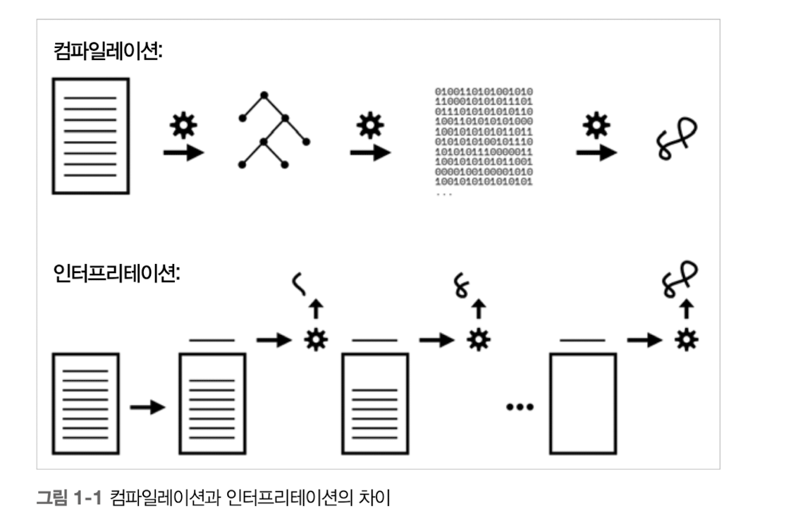
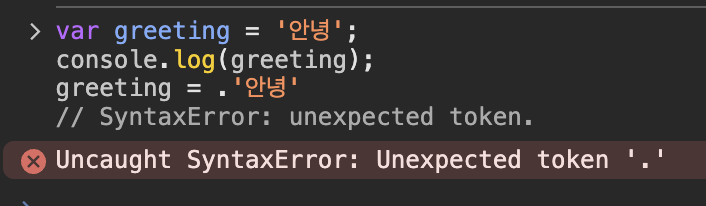
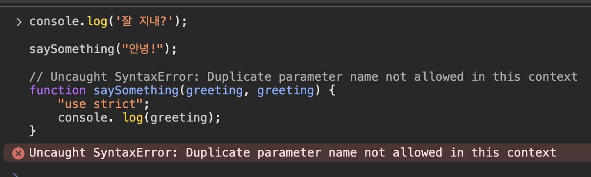
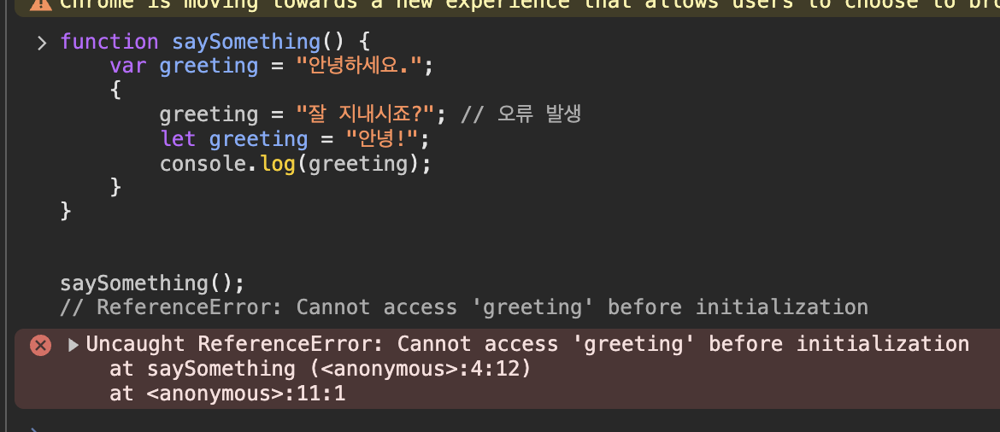
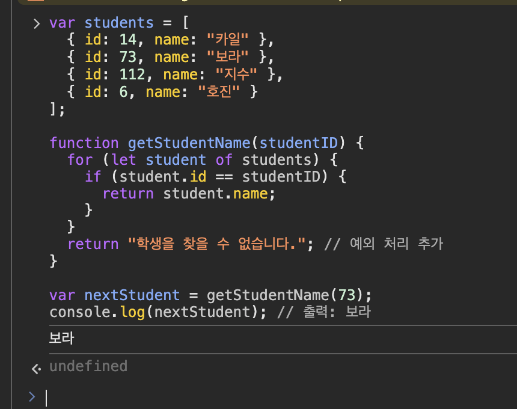
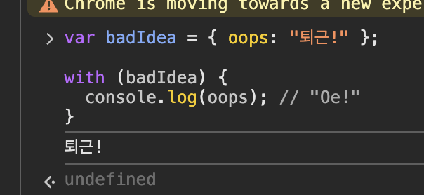

# 1.1 책에 대하여

다른 곳으로 넘긴 함수 내에서 외부 변수를 사용하는 경우, 해당 변수는 어딘가에 접근해야 하므로 JS에서는 함수를 프로그램 내 어디에서 실행했는지와는 상관없이 함수를 정의할 때 결정된 스코프를 유지한다. 이를 클로저라고 한다.

# 1.2 컴파일 vs 인터프린터

컴파일레이션은 텍스트 형식으로 작성한 코드를 처리해서 컴퓨터가 이해할 수 있는 작업 지시 목록으로 바꾸는 일련의 과정이다.

인터프리테이션은 개발자가 작성한 프로그램을 기계가 해석할 수 있는 명령으로 변환한다는 점에서 컴파일과 유사하다. 하지만 처리방식이 다르다. 컴파일레이션은 프로그램을 한 번에 처리하는 반면 인터프리테이션은 소스 코드를 한 줄씩 변환한다.

<p align="center">
  
</p>

컴파일레이션과 인터프리테이션은 상호 배타적인 모델이다. 서로 공존할 수 없는 모델이다.

# 1.3 코드 컴파일

JS가 컴파일 언어인지 아닌지 따지는 게 중요하다.

고전 컴파일러 이론에서는 프로그램이 컴파일러의 다음 세 가지 주요 단계를 거쳐 처리된다고 정의한다.

- 1단계: 토크나이징/렉싱
- 2단계: 파싱
- 3단계: 코드 생성

다른 언어와 달리 JS 컴파일레이션은 구축 단계에서 일어나는 게 아니기 때문에 JS 엔진은 충분한 시간을 확보하지 못한 채 맡은 임무나 최적화를 수행한다.

JS 엔진은 가능한 한 모든 종류의 꼼수(레이지 컴파일, 리컴파일)을 사용한다.

## 1.3.1 필수 두 단계

JS는 프로그램 처리는 최소 파싱과 컴파일이라는 두 단계에서 일어난다.

파싱과 컴파일이 먼저 일어나고 그다음에 실행이 된다.

### 구문오류

```tsx
var greeting = '안녕';
console.log(greeting);
greeting = .'안녕'
// SyntaxError: unexpected token.
```

<p align="center">
  
</p>

JS가 위에서 아래로 실행되면서 ‘안녕` 이라는 문구가 출력되지 않고 구문 오류가 발생한다.

JS 엔진 입장에서 세 번째 줄에 구문 오류가 있다는 사실을 알 수 있는 유일한 방법은 첫째 줄과 둘째 줄을 실행하기 전, 즉 프로그램을 실행하기 전에 전체 프로그램을 먼저 파싱하는 방법뿐이다.

### 초기 오류

```tsx
console.log("잘 지내?");

saySomething("안녕!");

// Uncaught SyntaxError: Duplicate parameter name not allowed in this context
function saySomething(greeting, greeting) {
  "use strict";
  console.log(greeting);
}
```

<p align="center">
  
</p>

예시를 실행하면 ‘잘 지내?’라는 메시지는 출력되지 않는다. 엄격모드에서는 이름이 같은 함수 매개변수가 허용되지 않는다.

프로그램 실행 전에 코드 전체가 파싱된다는 가정만이 이런 현상을 설명할 수 있는 유일한 답이다.

### 호이스팅

```tsx
function saySomething() {
  var greeting = "안녕하세요.";
  {
    greeting = "잘 지내시죠?"; // 오류 발생
    let greeting = "안녕!";
    console.log(greeting);
  }
}

saySomething();
// ReferenceError: Cannot access 'greeting' before initialization
```

<p align="center">
  
</p>

JS 엔진 입장에서 다음 구문이 이름(greeting)이 같고 스코프는 블록인 변수가 선언되었기 때문에 오류가 발생한다는 걸 알 수 있다. 이걸 알 수 있는 유일한 방법은 오류가 발생한 문이 실행되기 전, 프로그램 내 스코프와 변수 관계를 전부 사전에 파악하는 것뿐이다.

프로그램이 실행되기 전 파싱이 이뤄져야만 이런 스코프와 선언에 관한 처리가 정확해진다.

인터프린터만으로 프로그램을 실행하면 성능 측면에서 아주 비효율적이기 때문에 이런 경우는 극히 드물다.

JS 엔진이 프로그램을 처리할 때 내부에서 일어나는 일은 인터프리테이션보다는 컴파일레이션에 훨씬 더 가깝다.

# 1.4 컴파일러체

```tsx
var students = [
  { id: 14, name: "카일" },
  { id: 73, name: "보라" },
  { id: 112, name: "지수" },
  { id: 6, name: "호진" },
];

function getStudentName(studentID) {
  for (let student of students) {
    if (student.id == studentID) {
      return student.name;
    }
  }
  return "학생을 찾을 수 없습니다."; // 예외 처리 추가
}

var nextStudent = getStudentName(73);
console.log(nextStudent); // 출력: 보라
```

<p align="center">
  
</p>

선언을 제외하고 프로그램 내 모든 변수와 식별자는 할당의 `타겟`이나 값의 `소스`, 둘 중 하나의 역할을 한다.

할당된 값이 있다면 선수는 할당의 `타깃`이다. 그렇지 않으면 변수는 값의 `소스`가 된다.

## 1.4.1 할당의 타깃

```tsx
function getStudentName(studentId){
```

function 키워드로 선언한 함수는 타깃 참조의 특수한 케이스다.

함수의 관계는 할당문이 실행될 때 설정되는 게 아니라 스코프가 구성되지 시작하는 시점에 자동으로 설정된다.

## 1.4.2 값의 소스

# 1.5 런타임에 스코프 변경하기

스코프는 프로그램이 컴파일될 때 결정되고, 런타임 환경에는 영향을 받지 않는다

비엄격 모드에서는 런타임에도 프로그램의 스코프를 수정할 수 있는 방법이 2가지가 있다.

1. eval()

   1. 컴파일과 실행의 대상이 되는 문자열 형태의 소스 코드를 받는데 이 소스 코드는 런타임에 컴파일 실행
   2. eval()에 넘기는 소스 코드에 var나 function 선언이 있는 경우, 이 선언들은 eval()이 실행 중인 스코프를 변경한다.

      ```tsx
      function badIdea() {
        eval("var oops = 'O!';");
        console.log(oops); // ReferenceError: oops is not defined
      }

      badIdea();
      ```

   3. eval()를 사용하지 말아야 하는 이유는 성능 때문이다. 컴파일과 최적화가 이미 끝난 스코프를 다시 수정하기 때문에 CPU 자원을 쓸 수 밖에 없다.

2. with

   1. 특정 객체의 스코프를 지역 스코프로 동적으로 변환한다.
   2. 스코프가 변환되면 새로운 지역 스코프에서는 객체의 프로퍼티가 식별자가 되기 때문에 객체를 통하지 않고 바로 사용할 수 있다.

      ```tsx
      var badIdea = { oops: "퇴근!" };

      with (badIdea) {
        console.log(oops); // "Oe!"
      }
      ```

      <p align="center">
        
      </p>

   3. with 역시 성능과 가독성에 좋지 않다.

# 1.6 렉시컬 스코프

JS에서는 스코프가 컴파일 타임에 결정된다. 컴파일 타임에 결정되는 스코프를 렉시컬 스코프라고 한다.

렉시컬 스코프의 핵심은 함수나 블록, 변수 선언의 스코프는 전적으로 코드 배치에 따라 제한된다.

컴파일 도중에는 프로그램 실행에 필요한 모든 렉시컬 스코프가 들어간 지도가 만들어진다.

런타임에 사용할 모든 코드가 들어간 계획안이 이때 만들어진다.

컴파일 중에는 스코프를 식별하기만 하고 실제 각 스코프를 실행해야만 하는 런타임 전까지는 스코프가 생성되지 않는다.

<aside>
💡

느낀점
JS는 컴파일일까? 인터프리터일까? 예제로 보여준 것으로는 컴파일의 모습을 보여주고 있다.

인터프린터만으로 프로그램을

eval은 js가 동적으로 코드를 실행할 수 있도록 만들어진 함수이다. 하지만 보안상의 이유로 사용하지 않는다. 과거에는 json을 파싱하는 용도로 사용했다고 한다.

with는 책을 통해서 처음 알았다.

</aside>
