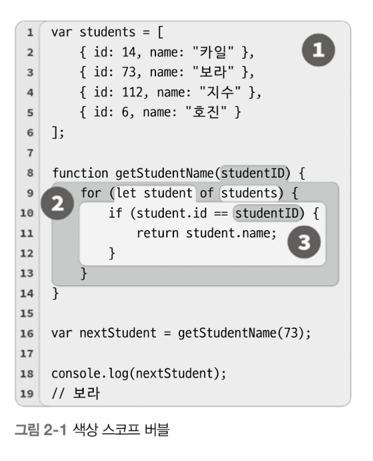

컴파일레이션 중 스코프가 결정되는 방식과 이를 `렉시컬 스코프`라 부른다.

`렉시컬은` 컴파일의 세 단계중 첫 번째 단계인 렉싱(파싱)을 의미한다.

## 2.1 구슬과 양동이

구슬은 프로그램 내 변수, 양동이는 스코프(함수 혹인 블록), 양동이에 칠한 색은 각 스코프를 의미

<p align="center">
  
</p>

스코프 버블은 함수/블록 스코프가 어디에 있느냐에 따라 컴파일 중에 결정된다. 3번이 2번에, 2번이 1번에 속하는 것처럼 스코프 블록은 서로 중첩이 가능하다.

스코프에 동시에 포함되는 일은 절대 일어나지 않는다.

JS 엔진은 컴파일 중에 프로그램을 처리하기 때문에 변수가 선언된 곳을 찾는다는 건 `내가 지금 속한 스코프가 어디야?` 라고 질문하는 것과 같다.

선언도니 변수나 식별자 참조(비선언)할 때는 정의가 아래 혹은 안쪽 스코프에 있으면 불가능하다.

런타임 중에 이런 비선언 구슬 색을 결정짓는 절차를 우리는 탐색으로 개념화할 수 있다.

### 구슬과 양동이, 버블를 사용한 예시 정리

- 변수는 특정 스코프에서 선언된다. 이때 변수는 다양한 색의 구슬이고, 구슬은 같은 색 양동이에 담긴다.
- 선언이 이뤄진 스코프와 동일한 스코프에 있는 변수 참조, 혹은 선언이 이뤄진 스코프보다 더 싶은 스코프에 있는 변수 참조는 해당 스코프와 동일한 색을 가진 구술이 왼다. 그런데 중간에 있는 스코프가 변수 선언을 섀도잉하면 이런 규칙이 적용되지 않는다.
- 양동이 색과 양동이에 어떤 구슬이 담길지는 컴파일 중에 결정됩니다. 이렇게 컴파일레이션 과정에서 확정된 정보는 프로그램 실행 중에 변수(구슬 색)를 탐색하는 데 사용한다.

# 2.2 JS 엔진 구성원 간의 대화

구성원의 역할

- 엔진: 컴파일레이션을 시작부터 끝까지 책임지고 JS로 만든 프로그램을 실행
- 컴파일러: 엔진의 친구로, 파싱과 코드 생성 과정에 일어나는 모든 잡일을 담당함
- 스코프 매니저: 엔진의 또 다른 친구로, 선언된 모든 변수와 식별자를 담은 탐색용 목록을 작성하고 유지보수 함. 여기에 더해 코드 실행 시 선언된 변수와 식별자 접근 관련 규칙을 강제함

```tsx
var students = [
  { id: 14, name: "카일" },
  { id: 73, name: "보라" },
  { id: 112, name: "지수" },
  { id: 6, name: "호진" },
];

function getStudentName(studentID) {
  for (let student of students) {
    if (student.id == studentID) {
      return student.name;
    }
  }
}

var nextStudent = getStudentName(73);
console.log(nextStudent); // 출력: 보라
```

var students 변수에 할당하는 코드를 보면 우리는 일반적으로 이를 하나의 문으로 생각한다. JS 엔진은 그렇지 않다. 컴파일 중에 컴파일러가 처리하는 작업과 실행 중에 엔진이 처리하는 작업 두 개의 별도 작업으로 나눠 해당 문을 처리한다.

실제 컴파일러가 var students = […] 를 처리할 때 거치는 단계

1. 컴파일러는 var students를 만나면

   ➡ **이미 선언된 변수인지** 스코프에 확인하고,

   ➡ **없으면** 실행 시에 해당 스코프에 students 변수를 **선언 요청**합니다.

   ➡ **있으면** 새로 선언하지 않고 **무시**하고 넘어갑니다.

2. 엔진은 students = [] 할당을 실행하려고 할 때

   ➡ 현재 스코프에 students 변수가 **있는지 확인**

   ➡ **없으면 상위 스코프로 올라가며 탐색**

   ➡ **찾으면** 거기에 [] 배열을 **할당**

var students = […] 같은 문이 어떻게 처리되는지 요약

1. 컴파일러는 스코프 변수 선언을 준비한다. (현재 스코프에서 스코프 변수가 선언되어 있지 않은 경우)
2. 엔진은 엔진이 실행되는 동안, 문에서 할당 부분을 처리하기 위해 스코프 매니저에게 변수를 찾아달라고 부탁하고 변수를 undefined로 초기화해 사용할 준비를 한다. 그 이후에 변수에 배열을 할당한다.

# 2.3 중첩 스코프

모든 스코프는 한 번이든 여러 번이든 실행될 때마다 스코프에 해당하는 스코프 매니저 인스턴스를 갖게 된다. 이를 변수 호이스팅이라고 한다.

렉시컬 스코프의 중요한 특징 중 하나는 현재 스코프에서 식별자 참조를 찾을 수 없을 때 해당 스코프를 감싸는 바깥 스코프에서 식별자 참조를 찾는다.

이런 프로세스는 원하는 식별자 참조를 찾거나 더 이상 찾을 만한 스코프가 없을 때까지 계속된다.

## 2.3.1 탐색이 실패할 경우

원하는 식별자를 찾지 못한 경우에는 오류 발생 상태가 조성된다. 엄격 모드인지 아닌지에 따라 처리가 달라진다.

### undefined에 관한 혼란

JS에서 not defined와 undefined는 전혀 다른 단어이다.

접근 가능한 렉시컬 스코프에 식별자에 해당하는 변수 선언이 있는 경우, not defined를 not declared 혹은 undeclared와 같이 생각해도 좋다.

반면 undefined는 변수는 발견되었는데 해당 시점에 값이 없는 경우를 의미한다.

```tsx
var studentName;
typeof studentName; // "undefined"

typeof doesntExist; // "undefined"
```

undefined인지 undeclared 인지 혼동하지 않게 세심한 주의를 기울여야 한다.

### 전역 변수의 갑작스러운 등장

```tsx
function getStudentName() {
  // 변수 선언 없이 값 할당
  nextStudent = "보라";
}

getStudentName();

console.log(nextStudent); // '보라'
```

타깃 할당이라는 목적을 달성하기 위해 전역 스코프의 스코프 매니저가 돌발적으로 전역 변수를 만들어버리는데, 이런 스코프 매니저의 갑작스러운 동작은 골칫거리이다.

엄격 모드에서는 오류가 발생한다. 항상 엄격 모드에서 작업하고 변수는 반드시 선언해서 사용해라.

## 2.3.2 스코프 건물


1층은 현재 실행 중인 스코프를 나타내고, 꼭대기 층은 전역 스코프를 나타낸다. 타깃 혹은 소스 역할을 하는 변수 참조를 찾을 때는 지금 있는 층을 먼저 둘러보고 없으면 점점 위로 올라가 탐색한다.

# 2.4 정리

JS 엔진이 어떻게 소스코드를 읽어 스코프를 결정하고 사용하는지에 대한 멘탈 모델이 충분히 갖춰져야 한다.
