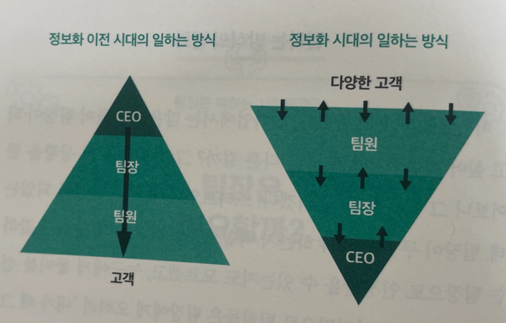
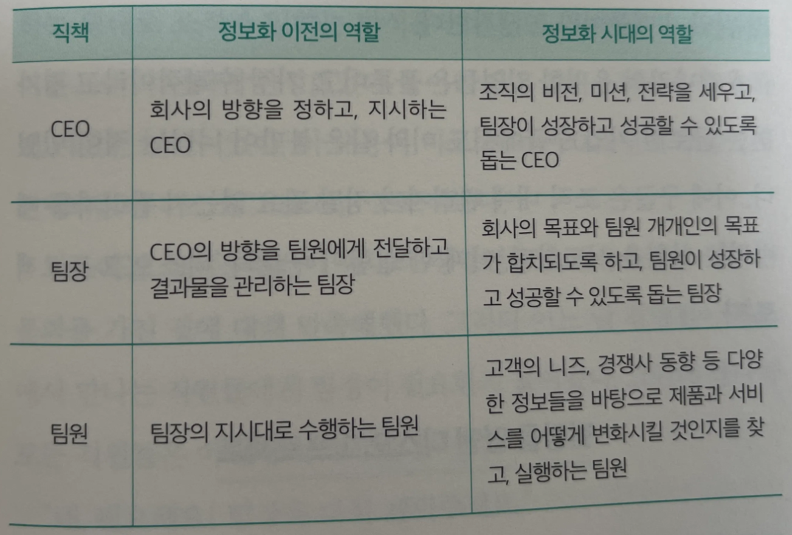
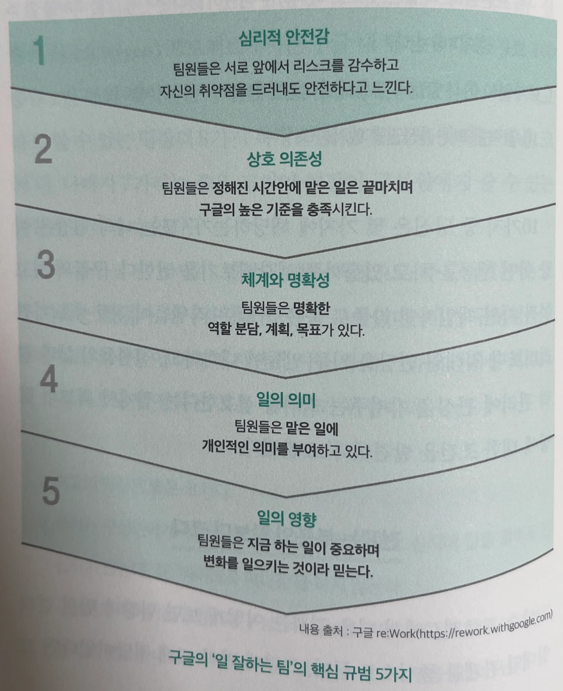

# 정답이 없는 시대

## 일하는 방식이 달라진 시대

과거 누가 고급 정보를 가지고 있느냐의 시대에서 나에게 필요한 정보를 누가 빨리 찾느냐의 시대가 되었다.

우리가 살아가는 이런 시대를 ‘정답이 없는 시대’라고 부른다.

## 정답이 없는 시대에 필요한 코치형 리더

구성원들이 스스로 그럴듯한 답을 찾도록 돕고, 그렇게 찾은 답을 스스로 실행, 피드백하며 계속해서 답을 찾을 수 있도록 성장을 도와주는 코치형 리더가 되어야 한다고 제안한다.

# 팀장은 필요할까?

## 일하는 방식의 변화

CEO와 팀장의 역할과 권한이 줄어드는 대신, 팀원들의 권한과 과업은 늘어나게 되었다.

  

  

## 팀장을 없앤 디스오그 프로젝트

1. 롤 모델: 보고 배울 수 있는 전문성을 갖춘 사람
2. 의사결정자: 의사결정을 잘할 수 있는 사람
3. 협업 및 갈등 중재자: 동료들과의 어색한 사이를 좁혀줄 수 있는 사람

## 산소 프로젝트를 통해 찾은 최고의 팀장

1. 최고의 팀장은 좋은 코치다.
2. 코치는 구성원에게 권한을 넘기고 간섭하지 않는다. 심지어 답을 알아도 간섭하지 않는다. 즉 마이크로 매니징을 하지 않는다.
3. 구성원의 이야기를 경청하며 구성원과 정보를 투명하게 공유한다. 내 의견을 말하는 것이 아니라 구성원이 이야기를 할 수 있도록 말을 이끌어 낸다. 
4. 생산적이며 결과 중심적이다.
5. 직원이 경력 개발을 할 수 있도록 돕는다.
6. 팀이 나아갈 방향에 대해 명확한 비전과 전략을 가진다.
7. 팀원에게 도움이 될 수 있는 조언을 할 수 있도록 전문성과 직무상 스킬을 가진다.
8. 팀원 개인의 성장에 관심을 가지고, 개인적인 상태에 대해서도 관심과 걱정을 표현한다. 더 좋은 곳으로 이직하는 팀원이 있다면 진심으로 축하를 할 수 있는 정도여야 한다.
9. 구글의 여러 팀들과 공통으로 작업을 한다.
10. 강력한 의사 결정권을 행사한다.

## 전체는 부분의 합보다 크다

  

심리적 안전감은 업무와 관련되어서 그 어떤 말을 해도 보복당하지 않고 안전하다고 느끼는 것이라고 할 수 있다. 팀의 다른 구성원들과 회의 시간에, 편한 대화를 하는 도중에, 팀장과 일대일 면담을 하면서 자신의 생각을 솔직하게 이야기할 수 있는 수평적 조직문화를 갖추고 있을 때 그 팀이 최고의 퍼포먼스를 낸다.

## 결국 팀장은 필요하다!

자신과 함께 일하는 구성원의 관점과 리더인 자신의 보는 관점이 다를 수밖에 없다. ‘말하지 않아도 내 마음을 알겠지’라는 건 혼자만의 오해다.

# 일을 잘 맡기는 팀장의 조건

## 10인분의 성공을 위한 ‘인내심’

리더들이 하고 싶지만 잘하지 못하는 일이 바로 부하 직원의 성장을 기다리는 것이다. 

**장기적인 관점에서 보면 조직이 더 커지고 더 성장하기 위해 리더에게 가장 중요한 건 구성원 한명 한명의 성장을 유도하는 것이다. 이를 통해 팀장은 1인분의 성공이 아닌 팀원 10인분의 성공을 위해 달려야 한다.**

## 팀원의 도전 정신을 이끌어라

1. 팀의 이상적인 목표와 비교할 때 현재 팀원의 모습은 어느 수준인가?
2. 현재 팀을 이루고 있는 팀원의 행동(일하는 방식 + 태도)은 어떠한가?
3. 어제와 다른 오늘이 되기 위해 팀원은 어떤 행동을 바꿔야 하는가?

## 팀원의 문제, 지적만 하지 말고 ‘이렇게’

문제를 해결 할 수 있는 방법과 제안을 제시하고 스스로 해결하고 발전할 수 있도록 한다.

## 격려가 ‘수고했어’로 끝나면 안 되는 이유

지지적 피드백은 잘하고 있는 행동과 일하는 방식, 좋은 태도와 습관이 지속될 수 있도록 인정하고 격려하며 칭찬하는 것이다.

아주 구체적인 표현이 좋다. 상세하게 일하는 방식과 행동에 대한 칭찬은 물론 그 행동이 끼친 긍정적인 영향까지 더하면서 팀원을 인정해 줘야 한다.

지지적 피드백을 잘하려면 평소 각 구성원에게 관심을 갖고 그들이 어떻게 일하고 있는지를 파악해야 한다. 그래서 팀장은 항상 팀원들이 어떻게 일하는지, 어떤 변화를 주는지, 그로 인해 조직에 어떤 영향을 주고 있는지를 관찰하고 있어야 한다.

# 팀장에게는 부캐가 필요하다

## 리더십은 하나가 아니다.

팀장이 10명의 팀원과 함께 팀을 구성하고 있다면 나는 10가지 리더십을 가지고 있어야 한다고 이야기한다. 10가지 ‘부캐’를 갖고 있는 것이라고도 할 수 있다.

## 팀장의 부캐는 3개

### 매니저

매니저는 조직의 성과를 관리하는 리더다.

매니저형 팀장은 자신의 팀이 목표를 달성했는가를 중심으로 판단한다.

매니저형 팀장의 약점은 단기적인 목표에 너무 치중한다는 것이다.

### 멘토

멘토는 구성원에게 조언과 충고를 해주는 리더로 이들은 사람과 상황에 관심을 둔다.

멘토형 팀장은 조언과 충고의 주도권을 갖고 있다.

팀장이 멘토의 역할을 감당하려면 직원에게 자신의 성공 경험뿐 아니라, 실패 경험을 비롯한 전문적인 지식 등 가지고 있는 모든 걸 팀원의 성장과 성공을 위해 꺼내 놓을 수 있어야 한다는 것이다. 

멘토형 팀장은 팀원들의 성장과 함께 스스로도 성장하고자 노력하는 리더의 모습으로 나타난다.

### 코치

코치는 구성원 각 개인이 스스로 목표를 달성할 수 있도록 동기부여 하는 리더다.

팀장들이 반드시 갖춰야 하는 역할이다.

코칭 리더십은 단기적인 성과 중심의 조직을 장기적인 성장 관점에서 바라보도록 시야를 전환하는 데도 많은 도움을 줄 수 있다.

코치 역할을 제대로 수행하려면 팀장이 많은 것을 내려놓아야 한다. 의사 결정권, 권한, 발언권, 평가권, 지시와 명령 등 우리가 흔히 리더십을 표현할 때 사용하는 주요 무기를 조금씩 팀원들에게 위임해야 하기 때문이다.

팀원 개개인의 성장과 성공을 통해 조직의 성과를 달성하도록 시간을 사용한다. 내가 직접 성과를 만들어 내던 담당 실무자에서, 다른 사람을 통해 성과를 내는 방법으로 일하는 방식을 전환해야 하는 것이다.

### 코치형 팀장의 6가지 원칙

1. 팀원의 강점과 약점을 알고, 각 개인이 생각하는 것과 일하는 방식이 다르다는 걸 인정한다.
2. 내가 생각하는 방법이 아닌, 팀원이 하고자 하는 방법을 팀원 스스로 실행할 수 있도록 환경을 만들어 준다.
3. 팀장의 권한 중 상당 부분을 팀원에게 적절한 방식으로 위임하는 훈련을 한다.
4. 팀원에게 관심을 가지고, 그가 어떻게 일하는지 행동을 관찰한다. 자신의 시간 중 20퍼센트 이상을 팀원과의 일대일 면담에 사용한다.
5. 팀장이 주도적으로 이야기하는 게 아니라 질문과 경청을 기반한 대화를 통해 팀원이 일할 동기를 받고 회사와 팀의 목표에 몰입하도록 격려한다.
6. 업무 과정에서 발전하는 팀원은 인정, 칭찬하고, 바르지 못한 방법이나 방향으로 일하는 팀원에게는 현재의 부족함과 명확한 개선점을 피드백한다.

  

## 체스 선수와 정원사

체스 선수형 팀장은 팀원을 체스의 말 정도로만 생각하기 때문에, 팀원이 자신의 생각을 그대로 실행하길 바란다. 

  

## 최고의 팀을 구성하는 ‘피자 2판의 원칙’

1명의 팀장이 효율적으로 관리할 수 인원은 피자 2판을 나눠 먹을 수 있는 인원이다. 보통 8~10명을 말한다.

### 정원사처럼 팀을 이끄는 5가지 방법

1. 스스로 뛰어난 코치가 되어야 한다. 팀원이 스스로 문제를 정의하고, 대안을 찾고, 실행할 수 있도록 자율권을 제공하고, 성장할 수 있는 환경을 줘야 한다.
2. 코치인 리더는 팀원이 성공과 성장을 할 수 있도록 행동과 일하는 방식을 관찰한다. 관찰을 통해 그들의 강점을 발견하고 그 강점으로 과업을 수행할 수 있도록 도와주기도 하고, 약점이나 장애물이 방해하지 못하도록 돕거나, 함께 제거하기도 한다.
3. 팀원 스스로의 역량에 대한 믿음을 줘야 한다. 그러기 위해 관찰한 것에 기반한 구체적인 행동을 칭찬하고, 지지를 담은 피드백을 아끼지 말아야 한다. 
4. 각 팀원이 일에 몰입할 수 있도록 지원하고, 일대일 면담을 수시로 진행해야 한다. 주 1회, 격주 1회 정도의 간격이 좋다. 
5. 팀은 적절한 리더십을 발휘할 수 있는 규모를 갖춰야 한다. 서로 원할한 소통을 할 수 있도록 10명 미만의 팀을 이루는 것이 좋다. 

# 성공하는 팀장은 ‘이것’이 다르다