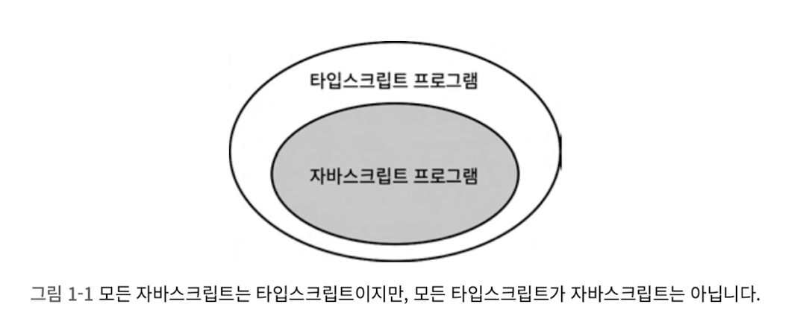
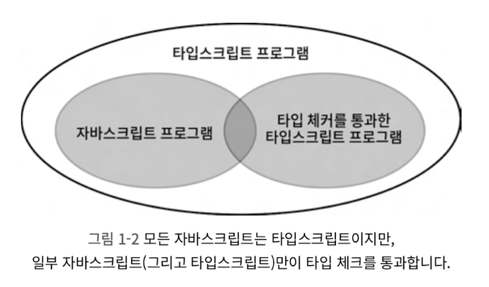
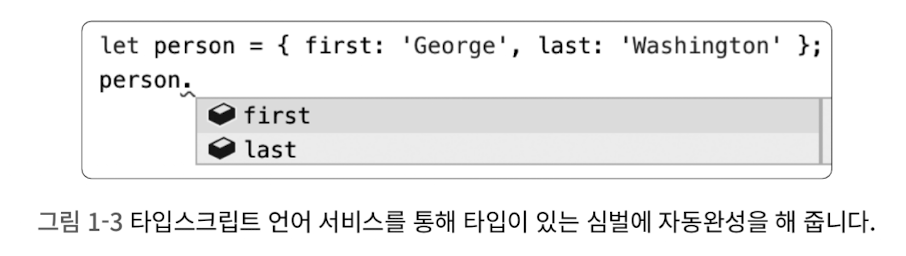
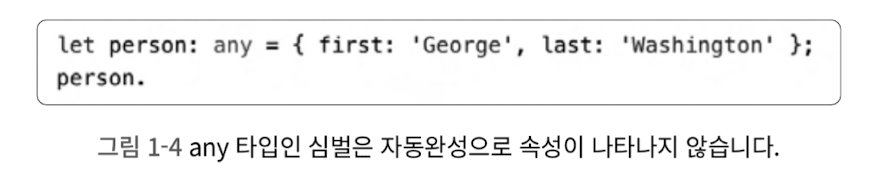

# 아이템 1 타입스크립트와 자바스크립트의 관계 이해하기

타입스크립트는 자바스크립트의 상위 집합이다.

타입스크립트는 타입이 정의된 자바스크립트의 상위집합이다.

<p align="center">
  
</p>

타입 추론은 타입스크립트에서 중요한 부분이다.

타입 시스템의 목표 중 하나는 런타임에 오류를 발생시킬 코드를 미리 찾아내는 것이다.

타입스크립트가 `정적` 타입 시스템이라는 것은 바로 이런 특징을 말한다.

타입스크립트는 타입 구문 없이도 오류를 잡을 수 있지만, 타입 구문을 추가한다면 훨씬 더 많은 오류를 찾아낼 수 있다.

코드의 `의도`가 무엇인지 타입 구문을 통해 타입스크립트에 알려줄 수 있기 때문에 코드의 동작과 의도가 다른 부분을 찾을 수 있다.

<p align="center">
  
</p>

타입스크립트 타입 시스템은 자바스크립트의 런타임 동작을 `모델링`한다.

# 아이템 2 타입스크립트 설정 이해하기

설정을 제대로 사용하려면, noImplicitAny와 strictNullChecks를 이해해야 한다.

## noImplicitAny

noImplicitAny는 변수들이 미리 정의된 타입을 가져야 하는지 여부를 제어한다.

타입스크립트는 타입 정보를 가질 때 가장 효과적이기 때문에, 되도록이면 noImplicitAny를 설정해야 한다.

## strictNullChecks

strictNullChecks는 null과 undefined가 모든 타입에서 허용되는지 확인하는 설정이다.

# 아이템 3 코드 생성과 타입이 관계없음을 이해하기

타입 오류가 있는 코드도 컴파일이 가능하다.

런타임에는 타입 체크가 불가능하다.

타입 정보를 유지하는 또 다른 방법으로는 런타임에 접근 가능한 타입 정보를 명시적으로 저장하는 `태그`기법이 있다.

```tsx
type Shape = Square | Rectangle;
```

타입(런타임 접근 불가)과 값(런타임 접근 가능)을 둘 다 사용하는 기법도 있다. 타입을 클래스로 만들면 된다. → 내가 주로 api response를 받아서 클래스로 변환해서 사용하는데 이런 이점이 있었구나!

## 타입 연산은 런타임에 영향을 주지 않는다

```tsx
function asNumber(val: number | string): number {
  return typeof val === "string" ? Number(val) : val;
}
```

## 런타임 타입은 선언된 타입과 다를 수 있다

`boolean` 의 경우 타입스크립트의 타입이기 때문에 런타임에서 제거된다. 선언된 타입이 언제든지 달라질 수 있다는 것을 명심해야 한다.

## 타입스크립트 타입으로는 함수를 오버로드 할 수 없다

타입스크립트가 자바스크립트로 변환되면서 오버로드된 내용은 제거되며, 구현체만 남게된다.

## 타입스크립트 타입은 런타임 성능에 영향을 주지 않는다

타입과 타입 연산자는 자바스크립트 변환 시점에 제거되기 때문에, 런타임 성능에 아무런 영향을 주지 않는다.

타입스크립트 컴파일러는 `빌드타임` 오버해드가 있다.

# 아이템 4 구조적 타이핑에 익숙해지기

자바스크립트는 본질적으로 덕 타이핑 기반이다.

> 덕 타이핑이란? 객체가 어떤 타입에 부합하는 변수와 메서드를 가질 경우 객체를 해당 타입에 속하는 것으로 간주하는 방식이다.

덕 테스트에서 유래되었는데, 다음과 같은 명제로 정의된다. 만약 어떤 새가 오리처럼 걷고, 헤엄치고, 꽦꽥거리는 소리를 낸다면 나는 그 새를 오리라고 부를 것이다.

>

좋든 싫든 타입은 열려있다.

정확한 타입으로 객체를 순회하는 것은 까다로운 문제이다.

# 아이템 5 any 타입 지양하기

타입스크립트의 타입 시스템은 점진적이고 선택적이다.

## any 타입에는 타입 안전성이 없다

혼돈은 걷잡을 수 없게 된다

## any는 함수 시그니처를 무시해 버린다.

함수를 작성할 때는 시그니처를 명시해야 한다. 호출하는 쪽은 약속된 타입의 입력을 제공하고, 함수는 약속된 타입의 출력을 반환한다.

## any 타입에는 언어 서비스가 적용되지 않는다

자동완성 기능과 적절한 도움말을 제공한다.

<p align="center">
  
</p>

any 타입인 심벌을 사용하면 도움을 받지 못한다.

<p align="center">
  
</p>

## any 타입은 코드 리팩터링 때 버그를 감춘다

## any는 타입 설계를 감춰버립니다

객체를 정의할 때 특히 문제가 되는데, 상태 객체의 설계를 감춰버리기 때문이다.

## any는 타입 시스템의 신뢰도를 떨어뜨린다

사람은 항상 실수를 한다. 보통은 타입 체커가 실수를 잡아주고 코드의 신뢰도가 높아진다.
