가장 중요한 역할을 타입 시스템에 있다.

# 아이템 6 편집기를 사용하여 타입 시스템 탐색하기

타입스크립트를 설치하면, 아래 2가지를 실행할 수 있다.

1. 타입스크립트 컴파일러(tsc)
2. 단독으로 실행할 수 있는 타입스크립트 서버(tsserver)

타입스크립트 서버 또한 `언어 서비스`를 제공한다는 점에서 중요하다.

언어 서비스에는 코드 자동 완성, 명세 검사, 검색, 리팩터링이 포함된다.

타입스크립트 서버에서 언어 서비스를 제공하도록 설정하는 게 좋다.

언어 서비스는 라이브러리와 라이브러리의 타입 선언을 탐색할 때 도움이 됩니다.

타입 선언은 처음에는 이해하기 어렵지만 타입스크립트가 무엇을 하는지, 어떻게 라이브러리가 모델링되었는지, 어떻게 오류를 찾아낼지 살펴볼 수 있는 훌륭한 수단이라는 것을 알 수 있다.

# 아이템 7 타입이 값들의 집합이라고 생각하기

`할당 가능한 값들의 집합`이 타입이라고 생각하면 된다. 이 집합은 타입의 `범위`라고 부르기도 한다.

가장 작은 집합은 아무 값도 포함하지 않는 공집합이며, 타입스크립트에서는 never 타입이다.

그 다음으로 작은 집합은 한 가지 값만 포함하는 타입이다. 이들은 타입스크립트에서 유닛(`unit`)타입이라고도 불리는 리터럴(`literal`) 타입이다.

```tsx
type A = "A";
type Twelve = 12;

type AB = "A" | "B";
type AB12 = "A" | "B" | 12;
```

유니온 타입은 값 집합들의 합집합이다.

구조적 타입 규칙들은 어떠한 값이 다른 속성도 가질 수 있음을 의미한다. 심지어 함수 호출의 매개변수에서도 다른 속성을 가질 수 있다.

`extends` 키워드는 제너릭 타입에서 한정자로도 쓰이며, 이 문맥에서는 `~의 부분 집합`을 의미하기도 한다.

할당과 상속의 괌점을 전환해 보면, 객체의 키 타입을 반환하는 `keyof T`를 이해하기 수월하다.

타입이 값의 집합이라는 건, 동일한 값의 집합을 가지는 두 타입은 같다는 의미가 된다. 두 타입이 의미상으로 다르고 우연히 같은 범위를 가진다고 하더라도, 같은 타입을 두 번 정의할 이유는 없다.

# 아이템 8 타입 공간과 값 공간의 심벌 구분하기

타입스크립트의 심벌(symbol)은 타입 공간이나 값 공간 중 한 곳에 존재한다.

타입스크립트 코드가 잘 동작하지 않는다면 타입 공간과 값 공간을 혼동해서 잘못 작성했을 가능성이 크다

class나 enum같은 키워드는 타입과 값 두 가지로 사용될 수 있다.

# 아이템 9 타입 단언보다는 타입 선언을 사용하기

```tsx
const alice: Persion = { name: "Alice" }; // 타입선언
const bob = { name: "Bob" } as Persion; // 타입단언
```

타입 단언보다 타입 선언을 사용하는 게 낫다.

타입 선언은 할당되는 값이 해당 인터페이스를 만족하는지 검사한다.

타입 단언은 강제로 타입을 지정했으니 타입 체커에세 오류를 무시하라고 하는 것이다.

**타입 단언이 꼭 필요한 경우가 아니라면, 안전성 체크도 되는 타입 선언을 사용하는 것이 좋다**.

<p align="center">
  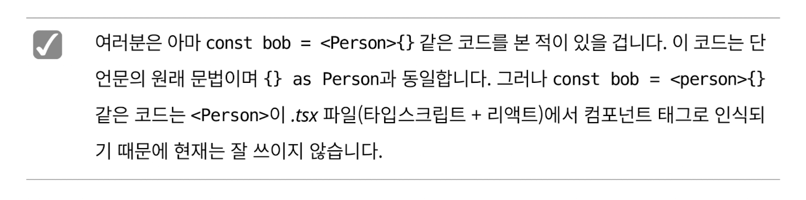
</p>

타입스크립트는 DOM에 접근할 수 없기 때문에 여기서는 타입 단언문을 쓰는 것이 타당하다.

<p align="center">
  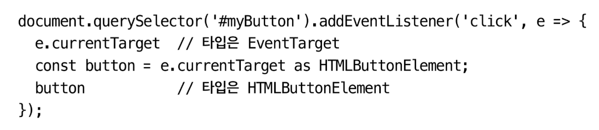
</p>

우리는 !를 일반적인 단언문 처럼 생각해야 한다. 단언문은 컴파일 과정 중 제거되므로, 타입 체커는 알지 못하지만 그 값이 null이 아니라고 확신할 수 있을 때 사용해야 한다. 만약 그렇지 않다면, null인 경우도 체크하는 조건문을 사용해야 한다.

<p align="center">
  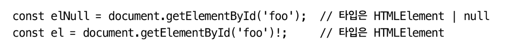
</p>

`unknown`을 사용은 적어도 무언가 위험한 동작을 하고 있다는 것을 알 수 있다.

<p align="center">
  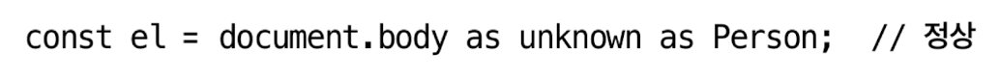
</p>

# 아이템 10 객체 래퍼 타입 피하기

String 객체는 오직 자기 자신하고만 동일하다.

<p align="center">
  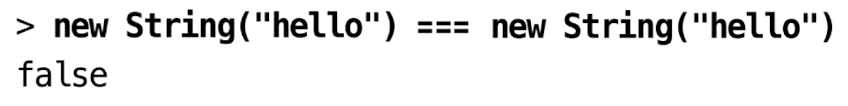
</p>

기본형 타입을 객체 래퍼에 할당하는 구문은 오해하기 쉽고, 굳이 그렇게 할 필요도 없다. 그냥 기본형 타입을 사용하는 것이 낫다.

타입스크립트 객체 래퍼 타입은 지양하고, 대신 기본형 타입을 사용한다.

- String → string
- Number → number
- Boolean → boolean
- Symbol → symbol
- BigInt → bigint

# 아이템 11 잉여 속성 체크의 한계 인지하기

<p align="center">
  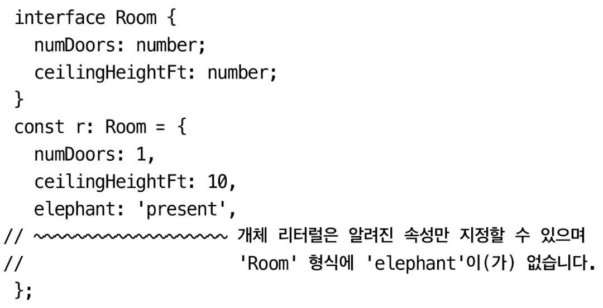
</p>

구조적 타입 시스템에서 발생할 수 있는 중요한 종류의 오류를 잡을 수 있도록 `잉여 속성 체크` 라는 과정이 수행되었다.

잉여 속성 체크가 할당 가능 검사와는 별도의 과정이라는 것을 알아야 타입스크립트 타입 시스템에 대한 개념을 정확히 잡을 수 있다.

타입스크립트는 단순히 런타임에 예외를 던지는 코드에 오류를 표시하는 것뿐 아니라, 의도와 다르게 작성된 코드까지 찾으려 한다.

잉여 속성 체크는 타입 단언문을 사용할 때에도 적용되지 않는다.

잉여 속성 체크는 구조적 타이핑 시스템에서 허용되는 속성 이름의 오타 같은 실수를 잡는 데 효과적인 방법이다.

오직 객체 리터럴에만 적용된다. 이러한 한계점을 인지하고 잉여 속성 체크와 일반적인 타입 체크를 구분한다면, 두 가지 모두의 개념을 잡는 데에 도움이 될 것이다.

## 요약

- 객체 리터럴을 변수에 할당하거나 함수에 매개변수로 전달할 때 잉여 속성 체크가 수행된다.
- 잉여 속성 체크는 오류를 찾는 효과적인 방법이지만, 타입스크립트 타입 체커가 수행하는 일반적인 구조적 할당 체크와 역할이 다르다.
- 할당의 개념을 정확히 알아야 잉여 속성 체크와 일반적인 구조적 할당 가능성 체크를 구분할 수 있다.
- 잉여 속성 체크에는 한계가 있다. 임시 변수를 도입하면 잉여 속성 체크를 건너뛸 수 있다는 점을 기억해야 한다.

# 아이템 12 함수 표현식에 타입 적용하기

자바스크립트(그리고 타입스크립트)에서는 함수 문장과 함수 표현식을 다르게 인식한다.

<p align="center">
  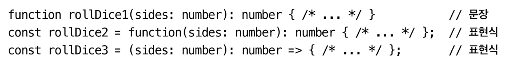
</p>

타입스크립트에서는 함수 표현식을 사용하는 것이 좋다.

- 함수의 매개변수부터 반환값까지 전체 함수 타입으로 선언하여 함수 표현식에 재사용할 수 있다는 장점이 있다.
- 함수의 매개변수에 타입 선언을 하는 것보다 함수 표현식 전체 타입을 정의하는 것이 코드도 간결하고 안전하다.
- 동일한 타입 시그니처를 가지는 여러 개의 함수를 작성할 때는 매개 변수의 타입과 반환 타입을 반복해서 작성하지 말고 함수 전체의 타입 선언을 적용해야 한다.
- 매개변수나 반환 값에 타입을 명시하기보다는 함수 표현식 전체에 타입 구문을 적용하는 것이 좋다

# 아이템 13 타입과 인터페이스의 차이점 알기

타입스크립트에서 명명된(`named type`)을 정의하는 방법은 두 가지가 있다.

타입과 인터페이스 사이에 존재하는 차이를 분명하게 알고, 같은 상황에서는 동일한 방법으로 명명된 타입을 정의해 일관성을 유지해야 한다.

복잡한 타입을 확장하고 싶다면 타입과 `&`을 사용해야 한다.

인터페이스는 타입을 확장할 수 있지만, `유니온`은 할 수 없다.

`type`은 일반적으로 `interface`보다 쓰임새가 많다.

튜플과 배열 타입도 `type`키워드를 이용해 더 간결하게 표현할 수 있다.

인터페이스는 보강(augment)이 가능하다.

<p align="center">
  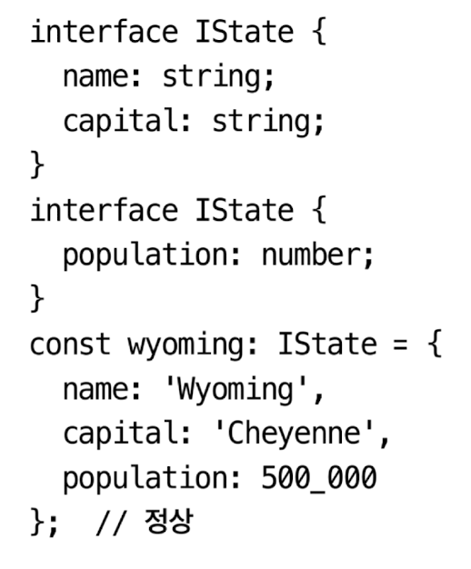
</p>

위 예제처럼 속성을 확장하는 것을 `선언 병합(declaration merging)`이라고 한다.

타입 선언 파일(ex: `global.d.ts`)을 작성할 때는 선언 병합을 지원하기 위해 반드시 인터페이스를 사용해야 하며 표준을 따라야 한다. 타입 선언에는 사용자가 채워야 하는 빈틈이 있을 수 있다.

복잡한 타입이라면 고민할 것도 없이 타입 별칭을 사용하면 된다.

어떤 API에 대한 타입 선언을 작성해야 한다면 인터페이스를 사용하는 게 좋다. API가 변경될 때 사용자가 인터페이스를 통해 새로운 필드를 병합할 수 있어 유용하기 때문이다. 그러나 프로젝트 내부적으로 사용되는 타입에 선언 병합이 발생하는 것은 잘못된 설계입니다.

# 아이템 14 타입 연산과 제너릭 사용으로 반복 줄이기

같은 코드를 반복하지 말라. DRY(don’t repeat yourself)

타입 중복은 코드 중복만큼 많은 문제를 발생시킨다.

<p align="center">
  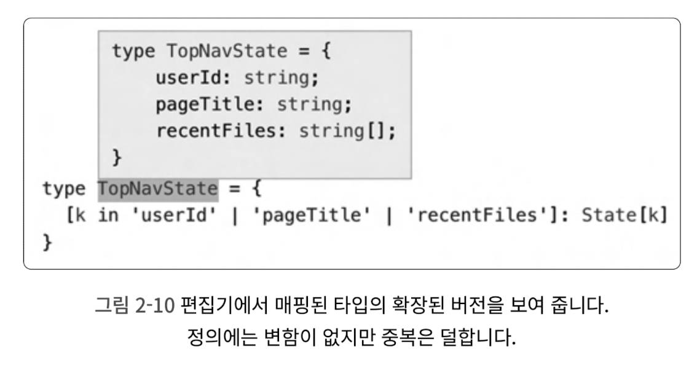
</p>

- Pick 사용
- keyof 사용
- Partial 사용

`const` 를 타입으로 사용하기

<p align="center">
  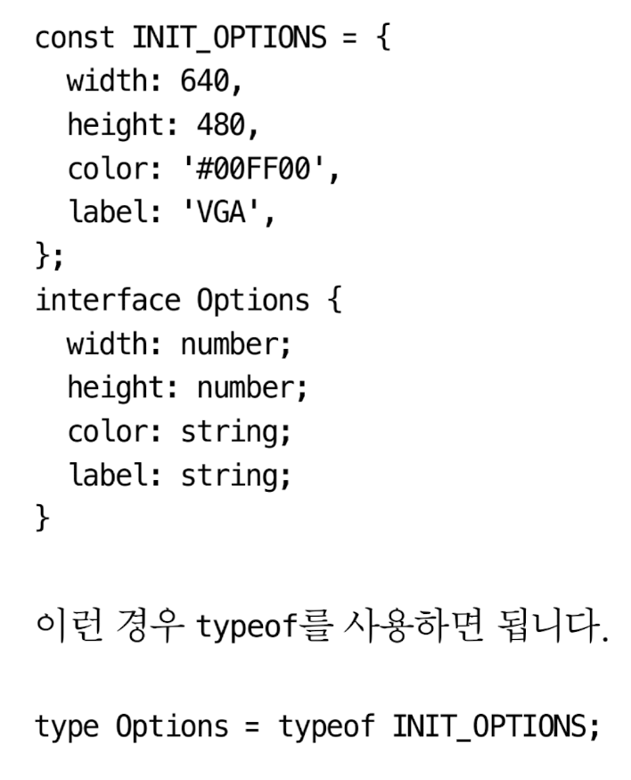
</p>

값으로부터 타입을 만들어 낼 때는 선언의 순서에 주의해야 한다.

함수나 메서드의 반환 값에 명명된 타입을 만들고 싶다면 `ReturnType` 제네릭을 사용하자

<p align="center">
  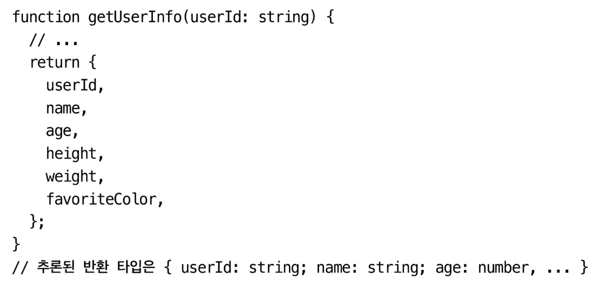
</p>

<p align="center">
  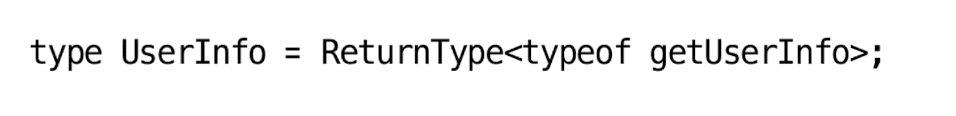
</p>

적용 대상이 값인지 타입인지 정확히 알고, 구분해서 처리해야 한다.

제너릭 타입은 타입을 위한 함수와 같다. 제네릭 타입에서 매개변수를 제한할 수 있는 방법은 extents를 사용한 넋이다.

<p align="center">
  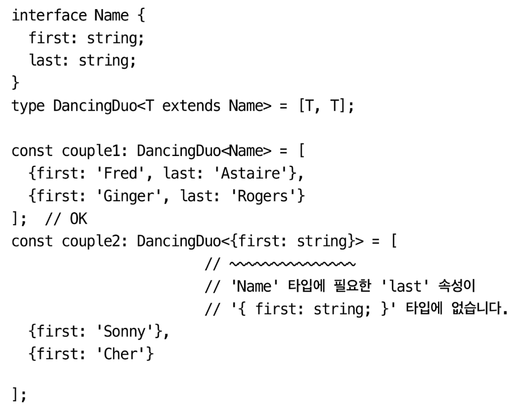
</p>

반복적인 코드는 타입 공간에서도 좋지 않다.

타입들 간의 매핑을 위해 타입스크립트가 제공한 keyof, typeof, 인덱싱 등

# 아이템 15 동적 데이터에 인덱스 시그니처 사용하기

타입스크립트에서는 타입에 `인덱스 시그니처`를 명시하여 유연하게 매핑을 표현할 수 있다.

<p align="center">
  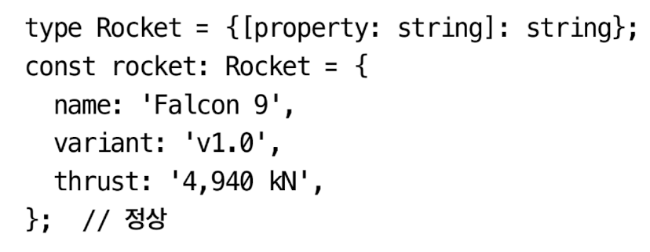
</p>

[property: string]: string이 인덱스 시그니처이며 아래 의미를 담고 있다.

- 키의 이름: 키의 위치만 표시하는 용도
- 키의 타입: string이나 number 또는 symbol 조합이어야 하지만 보통은 string을 사용한다.
- 값의 타입: 어떤 것이든 될 수 있다.
- 문제점
  - 잘못된 키를 포함해 모든 키를 허용한다.
  - 특정 키가 필요하지 않다.
  - 키마다 다른 타입을 가질 수 없다.
  - 자동 완성 기능이 동작하지 않는다.
  - 인덱스 시그니처는 부정확하므로 더 나은 방법을 사용해야 한다.

`인덱스 시그니처`는 동적 데이터를 표현할 때 사용해야 한다. → 서버에서 넘어오는 데이터?

# 아이템 16 number 인덱스 시그니처보다는 Array, 튜플, Arraylike를 사용하기

- 배열은 객체이므로 키는 숫자가 아니라 문자열이다.
- 인덱스 시그니처에 number를 사용하기보다 Array나 튜플, 또는 ArrayLike 타입을 사용하는 것이 좋다

# 아이템 17 변경 관련된 오류 방지를 위해 readonly 사용하기

<p align="center">
  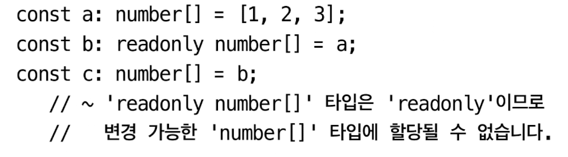
</p>

`readonly` 로 선언하면 아래와 같은 일이 생긴다.

- 타입스크립트는 매개변수가 함수 내에서 변경이 일어나는지 체크를 한다.
- 호출하는 쪽에서는 함수가 매개변수를 변경하지 않는다는 보장을 받게 된다.
- 호출하는 쪽에서 함수에 `readonly` 배열을 매개변수로 넣을 수 있다.

<p align="center">
  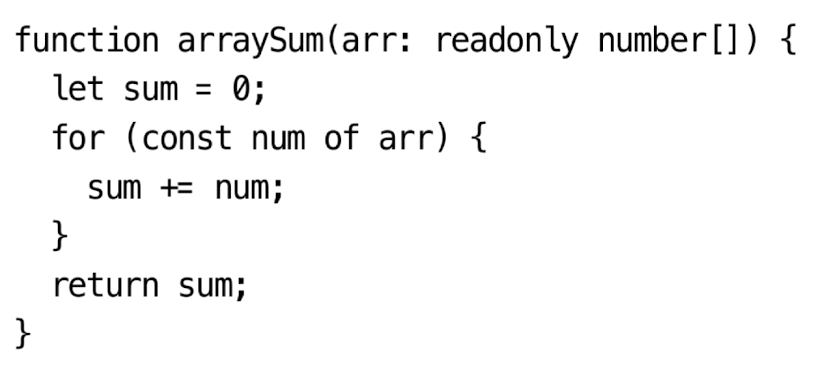
</p>

함수가 매개변수를 변경하지 않는다면, `readonly`로 선언해야 한다.

`readonly`는 얕게(shallow) 동작한다는 것을 유의해야 한다. 현재 시점에서는 깊은(deep) readonly는 기본으로 지원되지 않는다. 하지만 제너릭을 만들면 깊은 readonly 타입을 사용할 수 있다.

# 아이템 18 매핑된 타입을 사용하여 값을 동기화하기

<p align="center">
  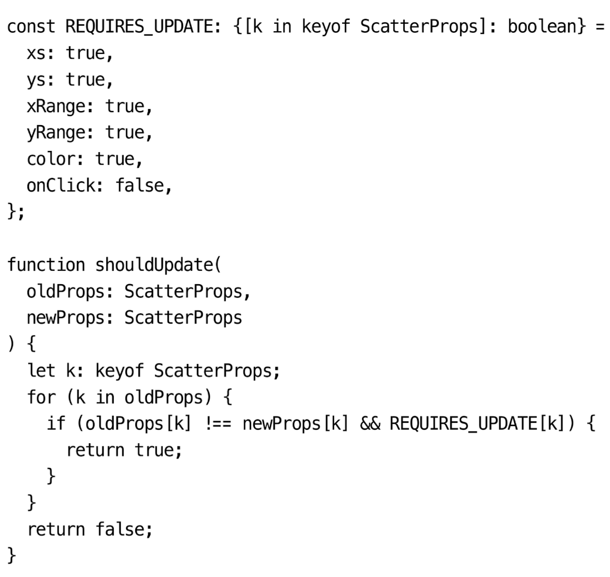
</p>

- 매핑된 타입을 사용해서 관련된 값과 타입을 동기화하도록 한다.
- 인터페이스에 새로운 속성을 추가할 때 선택을 강제하도록 매핑된 타입을 고려해야한다.
