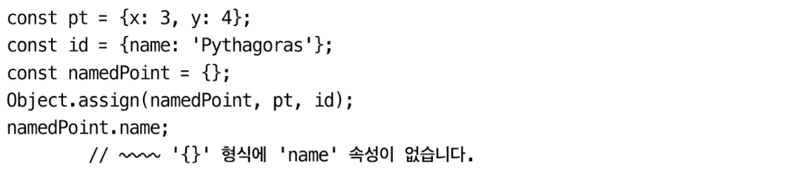

타입스크립트 초보자와 숙련자는 타입 구문의 수에서 차이가 난다.

- 숙련된 타입스크립트 개발자는 비교적 적은 수의 구문을 사용한다.
- 초보자의 코드는 불필요한 타입 구문으로 도배되어 있다.

# 아이템 19 추론 가능한 타입을 사용해 장황한 코드 방지하기

타입 추론이 된다면 명시적 타입 구문을 필요하지 않다. 오히려 방해가 될 뿐이다. → 불필요하게 명시적으로 타입 구문을 추가한 부분 제거하기

정보가 부족해서 타입스트립트가 스스로 타입을 판단하기 어려운 상황도 일부 있다. 그럴 때는 명시적 타입 구문이 필요하다.

타입 구문을 생략하여 방해되는 것들을 최소화하고 코드를 읽는 사람의 구현 로직에 집중할 수 있게 하는 것이 좋다.

타입이 추론될 수 있음에도 여전히 타입을 명시하고 싶은 몇 가지 상황이 있다.

1. 객체 리터럴을 정의할 때이다

   

     
   

   이런 정의에 타입을 명시하면 `잉여 속성 체크`가 동작한다. 선택적 속성이 있는 타입의 오타 같은 오류를 잡는 데 효과적이다. 그리고 변수가 사용되는 순간이 아닌 할당하는 시점에 오류가 표시되도록 해준다.

2. 함수의 반환에도 타입을 명시하여 오류를 방지할 수 있다.

   

     
   

3. 반환 타입을 명시하면, 구현상의 오류가 사용자 코드의 오류로 표시되지 않는다.
4. 반환 타입을 명시하면 함수에 대해 더욱 명확하게 알 수 있다.
5. 명명된 타입을 사용하기 위해서 명시한다

   

     
   

   return Vector2D를 기대하지만 결과를 아니다

# 아이템 20 다른 타입에는 다른 변수 사용하기

`변수의 값은 바뀔 수 있지만 그 타입은 보통 바뀌지 않는다`는 주요한 관점이다.

타입을 바꿀 수 있는 한 가지 방법은 범위를 좁히는 것이다. 새로운 변수 값의 타입을 더 작게 제한 하는 것이다.

할당 문에서 유니온 타입으로 범위를 좁힐 수 있다. 하지만 더 많은 문제가 생길 수 있다. id를 사용할 때마다 값이 어떤 타입인지 확인해야 하기 때문에 유니온 타입은 string이나 number 같은 간단한 타입에 비해 다루기 더 어렵다. 차라리 별도의 변수를 도입하는 것이 낫다.

다른 타입에는 별도의 변수를 사용하는 게 바람직한 이유는 다음과 같다.

- 서로 관련이 없는 두 개의 값을 분리한다.
- 변수명을 더 구체적으로 지을 수 있다.
- 타입 추론을 향상시키며, 타입 구문이 불필요해진다.
- 타입이 좀 더 간결해진다.
- let 대신 const로 변수를 선언하게 된다.

재사용되는 변수와 `가려지는(shadowed)` 변수를 혼동해서는 안 된다. 동작은 하지만 동일한 변수명은 사람에게 혼란을 줄 수 있다.

  

# 아이템 21 타입 넓히기

지정된 단일 값을 가지고 할당 가능한 값들의 집합을 유추하는데 타입스크립트에서는 이러한 과정을 `넓히기(widening)`라고 부른다.

타입스크립트는 넓히기의 과정을 제어할 수 있도록 몇 가지 방법을 제공한다.

1. const
   1. let 대신에 const로 변수를 선언하면 더 좁은 타입이 된다.

객체의 경우 타입 스크립트의 넓히기 알고리즘은 각 요소를 let으로 할당된 것으로 다룬다.

타입 추론의 간도를 직접 제어하려면 타입스크립트의 기본 동작을 재정의해야 한다.

1. 명시적 타입 구문을 제공한다.
2. 타입 체커에 추가적인 문맥을 제공한다.
3. const 단언문을 사용한다.

  

명시적 타입 구문 또는 const 단언문을 추가해 오류 발생에 대응할 수 있다.

# 아이템 22 타입 좁히기

가장 일반적인 예시는 null 체크일 것이다.

  

instanceof를 사용해서 타입을 좁힐 수 있다.

  

속성 체크로도 타입을 좁힐 수 있다.

  

Array.isArray 같은 일부 내장 함수로도 타입을 좁힐 수 있다.

  

타입을 좁히는 또 다른 일반적인 방법은 명시적 `태그`를 붙이는 것이다.

  

이 패턴은 `태그된 유니온(tagged union)` 또는 `구별된 유니온(discriminated union)` 이라고 불리며, 타입스크립트 어디에서나 찾아 볼 수 있다.

만약 타입스크립트가 타입을 식별하지 못한다면, 식별을 돕기 위해 커스텀 함수를 도입할 수 있다.

  

이러한 기법을 `사용자 정의 타입 가드`라고 한다.

# 아이템 23 한꺼번에 객체 생성하기

일부 자바스크립트 패턴을 타입스크립트로 모델링하는게 쉬워진다. 객체를 반드시 제각각 나눠서 만들어야 한다면, `타입 단언문(as)`을 사용해 타입 체커를 통과하게 할 수 있다.

  

작은 객체들을 조합해서 큰 객체를 만들어야 하는 경우에도 여러 단계를 거치는 것은 좋은 생각이 아니다.

  

`객체 전개 연산자`를 사용하면 큰 객체를 한꺼번에 만들어 낼 수 있다. 객체 전개 연산자를 사용하면 타입 걱정 없이 필드 단위로 객체를 생성할 수도 있다.

  

타입에 안전한 방식으로 조건부 속성을 추가하려면, 속성을 추가하지 않는 null또는 {}으로 객체 전개를 사용하면 된다.

  

전개 연산자로 한꺼번에 여러 속성을 추가할 수도 있다.

  

# 아이템 24 일관성 있는 별칭 사용하기

별칭의 값을 변경하면 원래 속성값에서도 변경된다.

  

  

별칭을 남발해서 사용하면 제어 흐름을 분석하기 어렵다. 타입스크립트에서도 마찬가지로 별칭을 신중하게 사용해야 한다. 그래야 코드를 잘 이해할 수 있고, 오류도 쉽게 찾을 수 있다.

별칭은 타입스크립트가 타입을 좁히는 것을 방해한다. 따라서 변수에 별칭을 사용할 때는 일관되게 사용해야 한다.

비구조화 문법을 사용해서 일관된 이름을 사용하는 것이 좋다

함수 호출이 객체 속성의 타입 정제를 무효화할 수 있다는 점을 주의해야 한다. 속성보다 지역 변수를 사용하면 타입 정제를 믿을 수 있다.

# 아이템 25 비동기 코드에는 콜백 대신 async 함수 사용하기

콜백이 중첩된 코드는 직관적으로 이해하기 어렵다. 프로미스(promise)는 미래에 가능해질 어떤 것을 나타낸다.

await 키워드는 각각의 프로미스 처리(resolve)가 될 때까지 함수의 실행을 멈춘다. async 함수 내에서 await 중인 프로미스가 거절(reject) 되면 예외를 던지고 이를 통해 일반적인 try/catch 구문을 사용할 수 있다.

  

콜백보다 프로미스나 async/await를 사용해야 하는 이유는 다음과 같다.

- 콜백보다는 프로미스가 코드를 작성하기 쉽다.
- 콜백보다는 프로미스가 타입을 추론하기 쉽다.

병렬로 페이지를 로드하고 싶다면 Promise.all을 사용해서 프로미스를 조합하면 된다.

  

이런 경우는 await과 구조 분해 할당이 찰떡궁합이다.

일반적으로 프로미스를 생성하기보다는 async/await를 사용해야 하는 이유는 다음과 같다.

- 일반적으로 더 간결하고 직관적인 코드가 된다.
- async 함수는 항상 프로미스를 반환하도록 강제한다.

# 아이템 26 타입 추론에 문맥이 어떻게 사용되는지 이해하기

타입스크립트는 타입을 추론할 때 단순히 값만 고려하지 않는다. 값이 존재하는 곳의 문맥까지도 살핀다.

`상수 문맥`은 const가 단지 값이 가리키니느 참조가 변하지 않는 얕은(shallow)상수인 반면, as const(상수 문맥)은 그 값이 내부까지(deeply) 상수라는 사실을 타입스크립트에게 알려준다.

  

  

as const 는 여러 겹중첩된 객체에서 오류가 발생한다면 근본적인 원인을 파악하기 어렵다.

## 객체 사용 시 주의점

문맥에서 값을 분리하는 문제는 문자열 리터럴이나 튜플을 포함하는 큰 객체에서 상수를 뽑아낼 때도 발생한다.

## 콜백 사용 시 중의점

콜백을 다른 함수로 전달할 때, 타입스크립트는 콜백의 매개변수 타입을 추론하기 위해 문백을 사용한다.

# 아이템 27 함수형 기법과 라이브러리로 타입 흐름 유지하기

직접 루프를 구현하면 타입 체크에 대한 관리도 직접 해야한다.

타입 흐름을 개선하고, 가독성을 높이고, 명시적인 타입 구문의 필요성을 줄이기 위해 직접 구현하기 보다 내장된 함수형 기법과 로대시 같은 유틸리티 라이브러리를 사용하는 것이 좋다.
