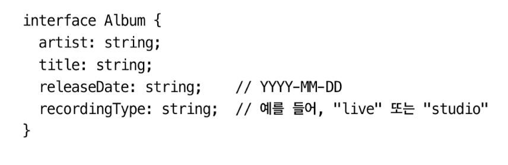

타입 시스템의 큰 장점 중 하나는 데이터 타입을 명확히 알 수 있어 코드를 이해하기 쉽다는 것이다.

# 아이템 28 유효한 상태만 표현하는 타입을 지향하기

타입을 잘 설계하면 코드는 직관적으로 작성할 수 있다.

효과적으로 타입을 설계하려면, 유효한 상태만 표현할 수 있는 타입을 만들어 내는 것이 가장 중요하다.

- 유효한 상태와 무효한 상태를 둘 다 표현하는 타입은 혼란을 초래하기 쉽고 오류를 유발하게 된다.
- 유효한 상태만 표현하는 타입을 지향해야 한다. 코드가 길어지거나 표현하기 어렵지만 결국 시간을 절약하고 고통을 줄일 수 있다.

# 아이템 29 사용할 때는 너그럽게, 생성할 때는 엄격하게

함수의 시그니처에도 `당신의 작업은 엄격하게 하고, 다른 사람의 직업은 너그럽게 받아드려야 한다.`는 비슷한 규칙을 적용해야 한다.

함수의 매개변수는 타입의 범위가 넓어도 되지만 결과를 반환할 때는 일반적으로 타입의 범위가 더 구체적이어야 한다.

매개변수 타입의 범위가 넓으면 사용하기 편리하지만, 반환 타입의 범위가 넓으면 불편하다. 즉, 사용하기 편리한 API일수록 반환 타입이 엄격하다.

# 아이템 30 문서에 타입 정보를 쓰지 않기 아이템

주석이 불필요하게 장황하며 함수의 선언과 구현제보다 주석이 더 길다.

타입 구문은 타입스크립트 타입 체커가 타입 정보를 동기화하도록 강제한다.

주석 대신 타입 정보를 작성한다면 코드가 변경된다 하더라도 정보가 정확히 동기화된다.

변수명을 ageNum으로 하는 것보다는 age로 하고, 그 타입이 number임을 명시하는게 좋다.

- 주석과 변수명에 타입 정보를 적는 것은 피해야 한다. 정보가 중복될 수 있고 최악의 정우는 타입 정보에 모순이 발생하게 된다.

# 아이템 31 타입 주변에 null 값 배치하기

undefined를 포함하는 객체는 다루기 어렵고 절대 권장하지 않는다.

한 값의 null 여부가 다른 값의 null 여부에 암시적으로 관련되도록 설계하면 안 된다.

API 작성 시에는 반환 타입을 큰 객체로 만들고 반환 타입 전체가 null 이거나 null 이 아니게 만들어야 한다.

클래스를 만들 때는 필요한 모든 값이 준비되었을 때 생성하여 null의 존재하지 않도록 하는 것이 좋다.

# 아이템 32 유니온의 인터페이스보다는 인터페이스의 유니온을 사용하기

유니온 타입의 속성을 여러 개 가지는 인터페이스에서는 속성 간의 관계가 분명하지 않기 때문에 실수가 자주 발생하므로 주의해야 한다.

유니온의 인터페이스보다 인터페이스의 유니온이 더 정확하고 타입스크립트가 이해하기도 좋습니다.

타입스크립트가 제어 흐름의 분석할 수 있도록 타입에 태그를 넣는 것을 고려해야 합니다. 태그된 유니온은 타입스크립트와 매우 잘 맞기 때문에 자주 볼 수 있는 패턴입니다.

# 아이템 33 string 타입보다 더 구체적인 타입 사용하기

string 타입으로 변수를 선언하려 한다면, 혹시 그보다 더 좁은 타입이 적절하지 않은 지 검토해 봐야 한다.

 <p align="center">
     
   </p>

string 타입이 남발된 모습

아래와 같이 타입의 범위를 좁히는 방법이 있다. 이러한 방식에는 세 가지 장점이 더 있다.

 <p align="center">
     
   </p>

1. 타입을 명시적으로 정의함으로써 다른 곳으로 값이 전달되어도 타입 정보가 유지된다.
2. 타입을 명시적으로 정의하고 해당 타입의 의미를 설명하는 주석을 붙여 넣을 수 있다.

   ```tsx
   /** Wath type of environment was this recording made in */
   type RecordingType = "live" | "studio";
   ```

  <p align="center">
    
  </p>

3. keyof 연산자로 더욱 세밀하게 객체의 속성 체크가 가능해진다.

문자열을 남발하여 선언된 코드를 피하자. 모든 문자열을 할당할 수 있는 string 타입보다는 더 구체적인 타입을 사용하는 것이 좋다

변수의 범위를 보다 정확하게 표현하고 싶다면 string 타입보다는 문자열 리터럴 타입의 유니온을 사용하면 된다. 타입 체크를 더 엄격히 할 수 있고 생산성을 향상 시킬 수 있다.

객체의 속성 이름을 함수 매개변수로 받을 때는 string보다 keyof T를 사용하는 것이 좋다.

# 아이템 34 부정확한 타입보다는 미완성 타입을 사용하기

타입을 정제(`refine`)할 때, 불쾌한 골짜기(`uncanny valley`) 은유를 생각해 보면 도움이 될 수 있다. 일반적으로 any 같은 추상적인 타입은 정제하는 것이 좋다. 그러나 타입이 구체적으로 정제된다고 해서 정확도가 무조건 올라가지는 않는다.

타입이 없는 것보다 잘못된 게 더 나쁘다.

정확하게 타입을 모델링할 수 없다면, 부정확하게 모델링하지 말아야 한다. 또한 `any`와 `unknown`를 구별해서 사용해야 한다.

타입 정보를 구체적으로 만들수록 오류 메시지와 자동 완성 기능에 주의를 기울여야 한다. 정확도뿐만 아니라 개발 경험과도 관련된다.

# 아이템 35 데이터가 아닌, API와 명세를 보고 타입 만들기

코드의 구석 구석까지 타입 안전성을 얻기 위해 API 또는 데이터 형식에 대한 타입 생성을 고려해야 한다.

데이터에 드러나지 않는 예외적인 경우들이 문제가 될 수 있기 때문에 데이터보다는 명세로 부터 코드를 생성하는 것이 좋다.

# 아이템 36 해당 분야의 용어로 타입 이름 짓기

엄선된 타입, 속성, 변수의 이름으 의도를 명확히 하고 코드와 타입의 추상화 수준을 높여준다. 잘못 선택한 타입 이름은 코드의 의도를 왜곡하고 잘못된 개념을 심어 주게 된다.

가독성을 높이고, 추상화 수준을 올리기 위해서는 해당 분야의 용어를 사용해야 한다.

같은 의미에 다른 이름을 붙이면 안 된다. 특별한 의미가 있을 때만 용어를 구분해야 한다.

# 아이템 37 공식 명칭에는 상표를 붙이기

공식 명칭을 사용하는 것은, 타입이 아니라 값의 관점을 말하는 것이다. 공식 명칭 개념을 타입스크립트에서 흉내 내려면 상표(brand)를 붙이면 된다. (비유를 들자면 스타벅스가 아니라 커피)

상표 기법은 타입 시스템에서 동작하지만 런타임에 상표를 검사하는 것과 동일한 효과를 얻을 수 있다. 타입 시스템이기 때문에 런타임 오버헤드를 없앨 수 있고 추가 속성을 붙일 수 없는 string이나 number 같은 내장 타입도 상표화할 수 있다.

타입스크립트는 구조적 타입핑(덕 타이핑)을 사용하기 때문에, 값을 세밀하게 구분하지 못하는 경우가 있다. 값을 구분하기 위해 공식 명칭이 필요하다면 상표를 붙이는 것을 고려해야 한다.
