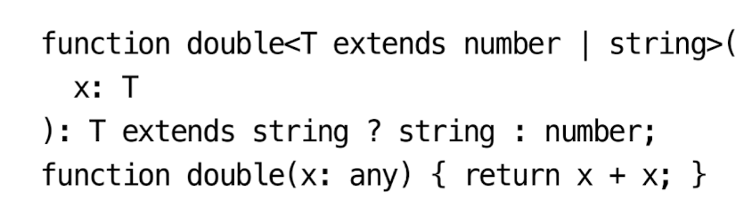

# 아이템 45 devDependencies에 @types 추가하기

npm 의존성

- `dependencies`: 현재 프로젝트를 실행하는 데 필수적인 라이브러리들이 포함
- `devDependencies`: 현재 프로젝트를 개발하고 테스트하는데 사용되지만, 런타임에는 필요없는 라이브러리들이 포함된다.
- `peerDependencies`: 런타임에 필요하긴 하지만, 의존성을 직접 관리하지 않는 라이브러리들이 포함된다.

타입스크립트와 관련된 라이브러리는 일반적으로 `devDependencies`에 속한다.

모든 타입스크립트 프로젝트에서 공통적으로 고려해야 할 의존성 두 가지

1. 타입스크립트 자체 의존성을 고려해야 한다.
   1. 팀원들 모두가 항상 동일한 버전을 설치한다는 보장이 없다.
   2. 프로젝트를 셋업 할 때 별도의 단계가 추가된다.
   3. 따라서 타입스크립트를 시스템 레벨로 설치하기보다는 `devDependencies`에 넣는 것이 좋다.
2. 타입 의존성(`@types`)을 고려해야 한다.

# 아이템 46 타입 선언과 관련된 세 가지 버전 이해하기

타입스크립트는 알아서 의존성 문제를 해결해 주기는커녕, 의존성 관리를 오히려 더 복잡하게 만든다.

- 라이브러리의 버전
- 타입 선언(`@types`)의 버전
- 타입스크립트의 버전

타입스크립트에서 일반적으로 의존성을 사용하는 방식

1. 특정 라이브러리를 `dependencies`로 설치하고, 타입 정보는 `devDependencies`로 설치

# 아이템 47 공개 API에 등장하는 모든 타입을 익스포트하기

타입들은 익스포트된 함수 시그니처에 등장하기 때문에 추출해 낼 수 있다. 추출하는 한 가지 방법은 `Parameter`와 `ReturnType` 제너릭 타입을 사용하는 것이다.

```tsx
type MySanta = ReturnType<typeof getGift>; // SecretSanta
type MyName = Parameters<typeof getGift>[0]; // SecretName
```

# 아이템 48 API 주석에 TSDoC 사용하기

사용자를 위한 문서라면 JSDoc 스타일 주석을 만드는 것이 좋다. 인라인 주석은 편집기가 표시해 주지 않는다.

타입 정의에 `TSDoc`을 사용할 수 있다.

`TSDoc` 주석은 마크다운 형식으로 꾸며지므로 굵은 글씨, 기울임 글씨, 글머리 기호 목록을 사용할 수 있다.

→ 이게 적용되는 건지는 몰랐다.

훌륭한 주석은 간단히 요점만 언급한다.

# 아이템 49 콜백에서 this에 대한 타입 제공하기

`this` 키워드는 매우 혼란스러운 기능이다.

`this` 는 다이나믹 스코프이다. 다이나믹 스코프의 값은 정의된 방식이 아니라 호출된 방식에 따라 달라진다.

`call`을 사용하면 명시적으로 `this`를 바인딩하여 문제를 해결할 수 있다. 일반적인 해결책은 생성자에서 메서드에 `this`를 바인딩시키는 것이다.

# 아이템 50 오버로딩 타입보다는 조건부 타입을 사용하기

가장 좋은 해결책은 조건부 타입을 사용하는 것이다. 조건부 타입은 타입 공간의 `if`구문과 같다.

조건부 타입은 자바스크립트의 삼항 연산자(`?:`)처럼 사용하면 된다.

 <p align="center">
    
</p>

- T가 string의 부분 집합이면 반환 타입이 string 그 외 number
- 유니온에 조건부 타입을 적용하면, 조건부 타입의 유니온으로 분리되기 때문에 number|string의 경우도 동작한다.

```tsx
// 삼항연산자를 중첩으로 사용하는 케이스 가독성이 좋지 않다
type TypeName<T> = T extends string
  ? "string"
  : T extends number
  ? "number"
  : T extends boolean
  ? "boolean"
  : T extends undefined
  ? "undefined"
  : T extends Function
  ? "function"
  : "object";

type T0 = TypeName<string>; // "string"
type T1 = TypeName<"a">; // "string"
type T2 = TypeName<true>; // "boolean"
type T3 = TypeName<() => void>; // "function"
type T4 = TypeName<string[]>; // "object"
```

# 아이템 51 의존성 분리를 위해 미러 타입을 사용하기

작성 중인 라이브러리가 의존하는 라이브러리의 구현과 무관하게 타입에만 의존한다면, 필요한 선언 부만 추출하여 작성 중인 라이브러리에 넣는 것 (미러링, `mirroring`)을 고려해 보는 것도 좋다.

웹 기반이나 자바스크립트 등 다른 모든 사용자에게는 더 나은 사양을 제공할 수 있다.

미러링 기법은 유닛 테스트와 상용 시스템 간의 의존성을 분리하는데 유용하다.

→ 읽으면 무슨 말인지 이해가 안 된다. 필요한 부분만 뽑아서 작성해서 사용하라는 의미인가? 라이브러리를 모두 불러오지 않고 구조적 타이핑을 활용하여 필요한 메서드와 속성만 별도 작성

GPT에게 물어보자

타입스트립트에서 한 인터페이스나 타입의 구조를 재활용하여 다른 타입이나 유틸리티로 사용하기 위한 방법이다. 주로 `의존성 분리`와 `타입 안정성` 유지를 위해 사용된다.

# 아이템 52 테스팅 타입의 함정에 주의하기

타입 선언을 테스트하기는 매우 어렵다. → 타입 선언도 테스트해야 하는거였어?

궁극적으로는 `dtslint` 또는 타입 시스템 외부에서 타입을 검사하는 유사한 도구를 사용하는 것이 더 안전하고 간단하다.

실제로 반환 타입을 체크하는 것이 훨씬 좋은 테스트 코드이다.

테스팅을 위해 할당을 사용하는 방법의 두 가지 근본적인 문제

1. 불필요한 변수를 만들어야 한다.
2. 두 타입이 동일한지 체크하는 것이 아니라 할당 가능성을 체크한다.

타입 체커와 독립적으로 동작하는 도구를 사용해서 타입 선언을 테스트하는 방법이 권장된다.

→ 타입 선언 테스트를 꼭 해야 하는지 모르겠다.

타입을 테스트할 때는 특히 함수 타입의 동일성(`equality`)과 할당 가능성(`assignability`)의 차이점을 알고 있어야 한다.
